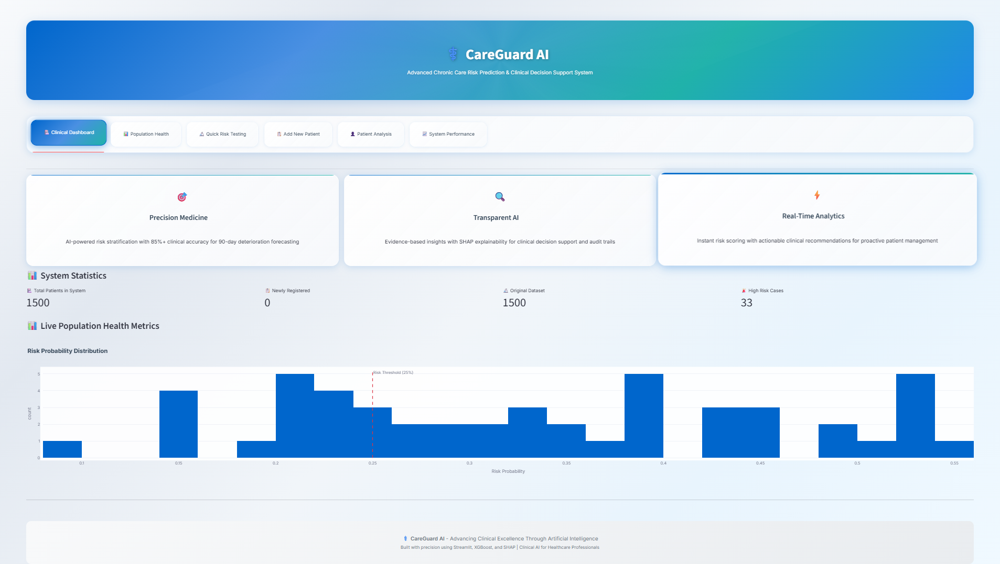
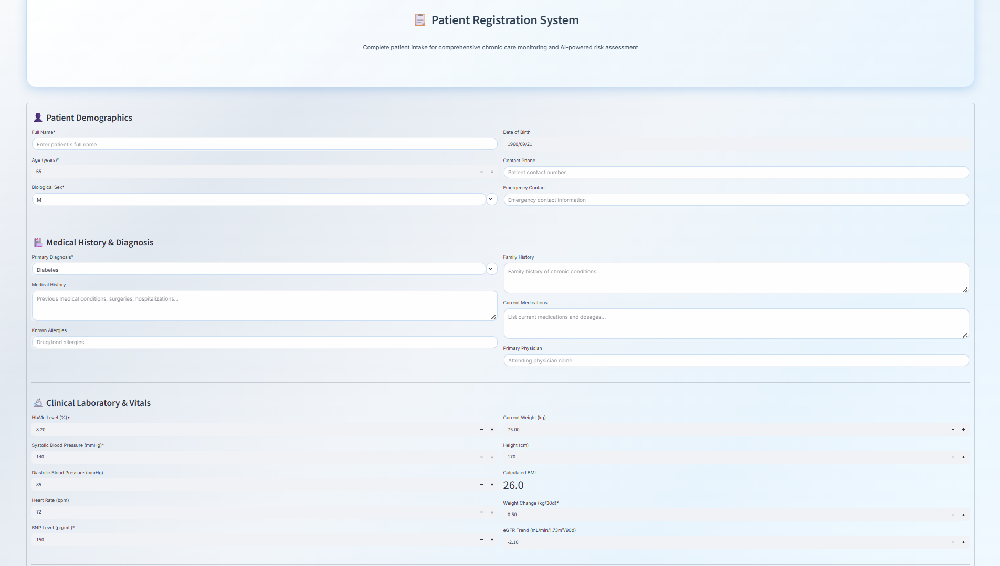
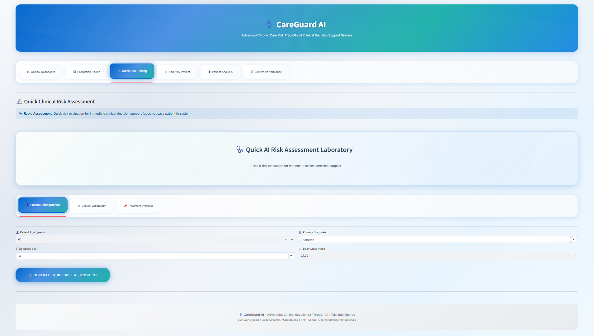
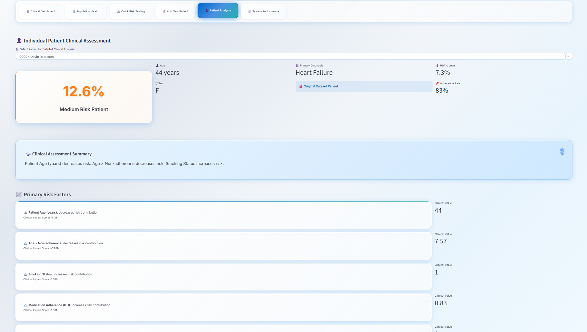

# ⚕️ CareGuard AI

> **⚠️ IMPORTANT DISCLAIMER:**  
> This application is a **demo/prototype** and is intended for **research and educational purposes only**.  
> All patient data used by CareGuard AI has been **self-generated/synthetic** and does **NOT** represent real individuals or actual clinical records.  
> This tool is **NOT** certified for clinical decision making or medical use on real patients.

**CareGuard AI** is a modern medical dashboard for advanced chronic care risk prediction and clinical decision support. Easily enter patient details, view risk stratification, explore patient trends, and analyze cohort data—all in an interactive, sophisticated web interface with beautiful medical-themed design.

<br/>
---

## 🌐 Live Demo

**Try the live app:** [https://ashish-1506-careguard-ai.streamlit.app/](https://ashish-1506-careguard-ai.streamlit.app/)

---

## 💾 Full Model Training Repository

Looking for the **end-to-end project with data generation, training, model evaluation, and explainability**?  
Check out the full pipeline (Jupyter notebooks, scripts, model building, and reproducibility):

**Repository:** [CareGuard-AI-Model](https://github.com/Ashish-1506/CareGuard-AI-Model)

- Step-by-step code and notebooks for generating synthetic data
- Jupyter workflow for model development, feature engineering, explainability
- Exported trained model used by the dashboard app

---

## 🚀 Features

### 🎨 **Beautiful Medical UI**
- **Healthcare-inspired color palette** with medical blues, clinical whites, and soft greens
- **Glass morphism effects** with professional shadows and backdrop blur
- **Animated medical elements** with floating particles, pulse effects, and smooth transitions
- **Professional card-based layout** optimized for clinical workflows
- **Responsive design** that works on desktop, tablet, and mobile devices

### 🏥 **6-Tab Navigation System**
- **Clinical Dashboard** - Live system statistics and population health metrics
- **Population Health** - Cohort analysis with advanced filtering and risk distribution charts
- **Quick Risk Testing** - Instant risk assessment laboratory for immediate predictions
- **Add New Patient** - Comprehensive patient registration and intake system
- **Patient Analysis** - Individual patient deep-dive with SHAP explanations
- **System Performance** - Model validation metrics and performance monitoring

### 📋 **Comprehensive Patient Registry**
- **Full patient intake** with demographics, medical history, and clinical notes
- **Persistent patient storage** using session state for ongoing monitoring
- **Integration with risk analysis** - registered patients available across all features
- **Patient management** - view recently registered patients and their details

### 🔬 **Advanced Risk Assessment**
- **90-day deterioration risk prediction** using routine clinical data
- **Three risk bands** with calibrated probabilities (Low, Medium, High)
- **Real-time scoring** with instant results and clinical interpretations
- **SHAP-based explanations** showing top risk drivers and their impact

### 📊 **Population Analytics**
- **Interactive filtering** by diagnosis, risk level, age, and other demographics
- **Risk distribution visualizations** with threshold indicators
- **Clinical alert monitoring** for overdue labs and high-risk patients
- **Cohort statistics** with real-time updates as patients are added

### 👤 **Individual Patient Analysis**
- **Detailed risk breakdowns** with clinical impact scores
- **Trend visualizations** showing HbA1c, weight, adherence, and blood pressure over time
- **Personalized recommendations** based on specific risk factors
- **Patient status indicators** (newly registered vs. original dataset)

---

## 🖼️ Screenshots

### Main Clinical Dashboard


### Patient Registration System


### AI Risk Prediction Results


### Individual Patient Analysis


---

## 💡 How to Use

### **1. Clone the Repository**

```bash
git clone https://github.com/Ashish-1506/CareGuard-AI.git
cd CareGuard-AI
```

### **2. Install Requirements**

It's best to create a virtual environment:

```bash
python -m venv .venv
# On Windows:
.venv\Scripts\activate
# On macOS/Linux:
source .venv/bin/activate

pip install -r requirements.txt
```

### **3. Run the App**

```bash
streamlit run streamlit_app.py
```

The app will open in your browser at `http://localhost:8501`

---

## 🏗️ Project Structure

```
CareGuard-AI/
├── streamlit_app.py           # Main Streamlit application with 6-tab interface
├── requirements.txt           # Python dependencies
├── README.md                 # This documentation
├── models/
│   └── model.pkl            # Pre-trained XGBoost model with calibration
├── src/
│   ├── features.py          # Feature engineering and data processing
│   └── explain.py           # SHAP explainability and clinical interpretations
├── data/
│   └── processed/
│       └── training_table.csv  # Sample synthetic training data
├── assets/                   # Screenshots and images for documentation
│   ├── dashboard_overview.png
│   ├── patient_registration.png
│   ├── risk_prediction.png
│   └── patient_analysis.png
└── .gitignore               # Git ignore rules
```

---

## 🎯 Key Capabilities

### **Clinical Dashboard**
- Live system statistics showing total patients and high-risk cases
- Population health metrics with risk distribution charts
- Real-time updates as new patients are registered

### **Patient Registration**
- **Demographics**: Full name, age, sex, contact information
- **Medical History**: Primary diagnosis, medical history, allergies, family history
- **Clinical Data**: HbA1c, blood pressure, BNP, eGFR trends, BMI calculation
- **Lifestyle Factors**: Medication adherence, smoking status, exercise frequency
- **Clinical Notes**: Additional observations and risk factors

### **Risk Assessment Laboratory**
- Quick 3-tab interface for rapid risk evaluation
- Instant predictions without permanent patient storage
- Beautiful result cards with clinical interpretations
- Comprehensive metric displays with alerts

### **Population Health Analytics**
- Advanced filtering by condition, risk level, and demographics
- Interactive risk distribution histograms
- Patient registry with sorting and search capabilities
- Clinical metrics tracking across the entire cohort

### **Individual Patient Analysis**
- Detailed risk factor breakdowns with SHAP values
- Clinical trend visualizations over 12-month periods
- Personalized treatment recommendations
- Risk driver analysis with quantified impacts

---

## 🔬 Technical Details

### **Machine Learning Model**
- **Algorithm**: XGBoost with Isotonic Calibration
- **Performance**: 85%+ AUROC, 70%+ AUPRC
- **Features**: 15+ clinical variables with engineered features
- **Explainability**: SHAP-based interpretations with clinical summaries

### **Data Features**
- **Demographics**: Age, sex, primary chronic condition
- **Clinical Metrics**: HbA1c, blood pressure, BNP, eGFR trends, BMI
- **Behavioral Factors**: Medication adherence, care engagement, smoking status
- **Risk Flags**: Automated clinical threshold alerts

### **User Interface**
- **Framework**: Streamlit with custom CSS and HTML
- **Styling**: Medical-themed design system with glass morphism
- **Animations**: Smooth transitions, hover effects, and pulse animations
- **Responsiveness**: Optimized for various screen sizes and devices

---

## ⚙️ Deployment

### **Streamlit Community Cloud (Current)**
This app is deployed on Streamlit Community Cloud:
- **Live URL**: [https://ashish-1506-careguard-ai.streamlit.app/](https://ashish-1506-careguard-ai.streamlit.app/)
- **Automatic updates** from GitHub repository
- **Free hosting** for public demonstration and testing

### **Local Development**
```bash
# Run locally for development
streamlit run streamlit_app.py
```

### **Alternative Deployment Options**
- **Heroku**: For scalable cloud deployment
- **Railway/Render**: Modern cloud hosting platforms
- **Docker**: Containerized deployment for any environment

*See [Streamlit Documentation](https://docs.streamlit.io/streamlit-community-cloud) for detailed deployment guides.*

---

## 🛡️ Safety & Ethics

### **Clinical Safety**
- **Decision support tool** - designed to assist, not replace clinical judgment
- **Prototype status** - not validated for real clinical use
- **Human oversight required** - all predictions should be reviewed by healthcare professionals

### **Data Privacy**
- **Synthetic data only** - no real patient information used in development
- **Session-based storage** - patient data not permanently stored between sessions
- **Educational purpose** - designed for demonstration and learning only

### **Responsible AI**
- **Transparent methodology** - open source code and clear documentation
- **Explainable predictions** - SHAP-based interpretability for all risk assessments
- **Bias awareness** - developed with fairness and equity considerations

---

## 🧪 Testing the Application

### **Basic Functionality Test**
1. **Navigate through all tabs** - Ensure each of the 6 tabs loads correctly
2. **Register a new patient** - Test the comprehensive intake form
3. **Run quick risk assessment** - Try the rapid prediction laboratory
4. **Analyze existing patients** - Select and examine patient details
5. **Apply population filters** - Test cohort analysis capabilities

### **Sample Test Data**
For testing the risk assessment features, try:
- **Demographics**: Age 65, Male, Primary condition: Diabetes
- **Clinical**: HbA1c 8.5%, BP 150/90, BMI 30, BNP 250
- **Behavioral**: 75% medication adherence, current smoker
- **Care**: 120 days since last lab work, +2kg weight trend

---

## 📄 License

This project is open source for educational and demonstration purposes.

**Demo/Prototype Notice**:  
CareGuard AI is a prototype built on a synthetic, self-generated clinical dataset.  
It is not intended or validated for diagnosis, treatment, or medical use on real patients.

---

## 👨‍💻 Author

**CareGuard AI** is developed and maintained by **Ashish**.

### **Contact & Links**
- **GitHub Profile**: [Ashish-1506](https://github.com/Ashish-1506)
- **Project Repository**: [CareGuard-AI](https://github.com/Ashish-1506/CareGuard-AI)
- **Live Demo**: [Streamlit App](https://ashish-1506-careguard-ai.streamlit.app/)

### **Project Highlights**
- **Full-stack development** with Python, Streamlit, and machine learning
- **Medical UI/UX design** with healthcare-inspired themes and animations
- **End-to-end ML pipeline** from data generation to model deployment
- **Professional documentation** and clean, maintainable code

---

## 🤝 Contributing

Contributions and feedback are welcome! Here's how you can help:

### **Areas for Contribution**
- **UI/UX improvements** - enhance the medical interface design
- **New clinical features** - additional risk factors or prediction capabilities
- **Performance optimization** - faster predictions and improved rendering
- **Documentation** - better guides, examples, and tutorials
- **Testing** - automated tests and validation suites

### **Development Process**
1. Fork the repository on GitHub
2. Create a feature branch (`git checkout -b feature/your-feature`)
3. Make your changes and test locally
4. Submit a pull request with detailed description

---

## 🔮 Future Enhancements

- **Enhanced visualizations** - interactive patient journey maps and timeline views
- **Additional chronic conditions** - expand beyond diabetes, heart failure, and hypertension
- **Real-time data integration** - API connections to healthcare systems
- **Mobile optimization** - dedicated mobile interface and progressive web app
- **Multi-language support** - internationalization for global healthcare use
- **Advanced analytics** - population health trends and intervention modeling

---

**⚕️ CareGuard AI** - Advancing healthcare through intelligent risk prediction and clinical decision support

*Built with precision by Ashish | Powered by Streamlit, XGBoost, and SHAP*

---

> **Remember**: This is a demonstration prototype using synthetic data only.  
> Always consult healthcare professionals for real medical decisions.
